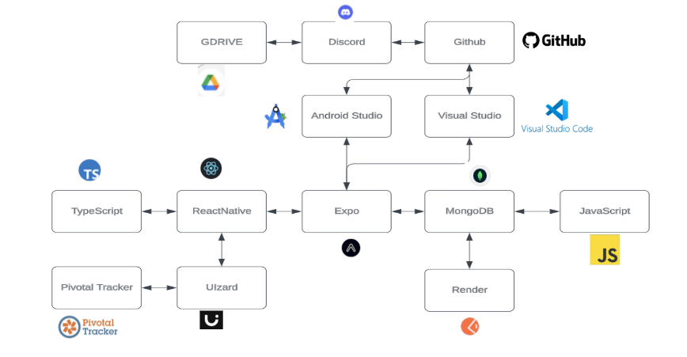

# CS633-Team-2

Team Member    | Roles
-------------- | -------------
Paridhi Talwar | Requirement Lead, QA Lead
Nidhi Desai    | QA Lead, Frontend Lead
Sergio Khalil  | Backend Developer, Frontend Lead
Sonny Wibisono | Project Manager, Front End Developer
Chaojin Guo    | UI Designer & Front End Developer
Zi Wang        | Backend Developer

# Smart Fridge Tracker

The Smart Fridge Tracker is an innovative and user-friendly application designed to revolutionize how you manage your kitchen inventory. Whether you're a busy professional, a home cook, or a culinary enthusiast, this app will help you keep track of your fridge and pantry items efficiently. By offering a comprehensive solution for managing ingredients, recipes, meal plans, and calorie tracking, Smart Fridge Tracker ensures you never run out of essential items, always have fresh ingredients at hand, and can maintain a healthy diet.

The application combines the power of modern technology with a simple interface, allowing users to easily log in, track their inventory, add and manage recipes, plan their meals, and monitor their calorie intake. Integrating various tools and platforms makes it a versatile and robust solution for all your kitchen management needs.

## Table of Contents

- [Features](#features)
- [Technology Stack](#technology-stack)
- [Installation](#installation)
- [Using Expo Go](#using-expo-go)

## Features

### Fridge and Pantry Management

Keep an accurate record of all the items in your fridge and pantry. The application allows you to:
- **Add Items**: Log new items into your inventory with details such as quantity, expiration date, and category.
- **Get Items**: View the current list of items in your fridge and pantry, along with their details.
- **Delete Items**: Remove items that have been used or are no longer needed.

### Recipe Management

Organize and access your favorite recipes at any time. Features include:
- **Add Recipes**: Input new recipes with ingredients, instructions, and preparation time.
- **Get Recipes**: Browse through your recipe collection and view detailed instructions.
- **Delete Recipes**: Remove recipes that you no longer use.

### Meal Planning

Plan your meals ahead of time to ensure you have all the ingredients you need. This feature allows you to:
- **Add Meal Plans**: Schedule meals for specific days, including breakfast, lunch, dinner, and snacks.
- **Get Meal Plans**: View your planned meals for the week or month.
- **Delete Meal Plans**: Update your meal plans by removing or changing meals as needed.

### Calorie Tracking

Maintain a healthy diet by keeping track of your calorie intake. The calorie tracking feature allows you to:
- **Log Calories**: Record the calorie content of the food items you consume.
- **View Calorie Intake**: Monitor your daily, weekly, or monthly calorie intake.

### User Authentication

Secure and straightforward user authentication ensures that your data is safe. The authentication system includes:
- **User Login**: Access your account securely with a username and password.
- **User Logout**: Log out of your account when you're done to protect your data.

## Technology Stack

- **Frontend**:
  - React Native: For building the user interface.
  - TypeScript: For type-safe programming.
  - Expo: For developing and deploying the React Native app.
- **Backend**:
  - Node.js: For server-side programming.
  - Express.js: For creating the backend API.
  - MongoDB: For database management.
- **Development Tools**:
  - Android Studio: For developing Android applications.
  - Visual Studio Code: For code editing.
  - GitHub: For source control.
  - Pivotal Tracker: For project management.
  - Render: For application deployment.



## Installation

To run the Smart Fridge Tracker application locally, follow these steps:

1. **Clone the Repository**:
   ```bash
   git clone https://github.com/your-username/smart-fridge-tracker.git
   cd smart-fridge-tracker
   ```

2. **Install Dependencies**:
   ```bash
   npm install
   ```

3. **Set Up Environment Variables**:
   Create a `.env` file in the root directory and add the following:
   ```
   MONGO_URI=your_mongo_db_uri
   ```

4. **Run the Application**:
   ```bash
   npm start
   ```


## Using Expo Go

Expo Go is a powerful tool that allows you to run your React Native projects on a physical device or emulator without needing to build a full native app. Here's how you can use Expo Go with the Smart Fridge Tracker:

### Step-by-Step Guide

1. **Install Expo CLI**:
   First, ensure you have Expo CLI installed globally on your machine. You can install it using npm or yarn:
   ```bash
   npm install -g expo-cli
   ```

2. **Start the Expo Project**:
   Navigate to the root directory of the Smart Fridge Tracker project and start the Expo server:
   ```bash
   npx expo start
   ```

3. **Download the Expo Go App**:
   - **For Android**: Install the Expo Go app from the Google Play Store.
   - **For iOS**: Install the Expo Go app from the Apple App Store.

4. **Scan the QR Code**:
   After starting the Expo server, a QR code will be displayed in your terminal or on the Expo Developer Tools webpage. Open the Expo Go app on your device and scan the QR code to start running the app on your physical device.

5. **Interact with the App**:
   You can now interact with the Smart Fridge Tracker app on your device. Any changes you make to the code will be automatically reflected on your device.
